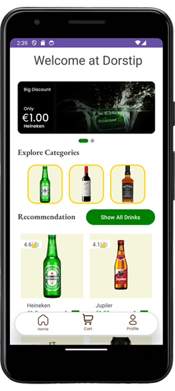

<a name="readme-top"></a>
<!-- PROJECT LOGO -->
<br />
<div align="center">
  <a href="https://github.com/AlexChulo/Dorstip-App2">
    
  </a>

  <h3 align="center">Dorstip App Project</h3>

  <p align="center">
    Welcome to my Dorstip App project!
    <br />
    <a href="https://github.com/AlexChulo/Dorstip-App2"><strong>Explore the documentation »</strong></a>
    <br />
    <br />
  </p>
</div>

<!-- TABLE OF CONTENTS -->
<details>
  <summary>Table of Contents</summary>
  <ol>
    <li>
      <a href="#about-the-project">About The Project</a>
      <ul>
        <li><a href="#built-with">Built With</a></li>
      </ul>
    </li>
    <li>
      <a href="#getting-started">Getting Started</a>
      <ul>
        <li><a href="#prerequisites">Prerequisites</a></li>
        <li><a href="#installation">Installation</a></li>
      </ul>
    </li>
    <li><a href="#usage">Usage</a></li>
    <li><a href="#roadmap">Roadmap</a></li>
    <li><a href="#communication-strategy">Communication Strategy and Evaluation</a></li>
    <li><a href="#current-state-and-implementation">Current State and Production Environment Implementation</a></li>
    <li><a href="#contact">Contact</a></li>
  </ol>
</details>

<!-- ABOUT THE PROJECT -->
## About The Project



My Dorstip App provides the following functionalities:

- User registration and login
- Showcasing products and categories
- Name-based and category-based product search
- Shopping cart functionality with quantity selection
- Product reviews

With this system, users can easily browse, review, and purchase products.

### Why Dorstip?

1. **Efficiency**: This system enhances the efficiency of online shopping by streamlining the process of finding and managing products.
2. **Accessibility**: Users can search for and purchase products anytime, anywhere, improving accessibility.
3. **User-Friendliness**: The intuitive design makes it easy for users to navigate through the various features of the app.

<p align="right">(<a href="#readme-top">back to top</a>)</p>

### Built With

[//]: # (Icons)
[Kotlin]: https://img.shields.io/badge/Kotlin-0095D5?style=for-the-badge&logo=kotlin&logoColor=white
[Firebase]: https://img.shields.io/badge/Firebase-FFCA28?style=for-the-badge&logo=firebase&logoColor=white
[Android Studio]: https://img.shields.io/badge/Android%20Studio-3DDC84?style=for-the-badge&logo=android-studio&logoColor=white

[//]: # (URLs)
[Kotlin-url]: https://kotlinlang.org/
[Firebase-url]: https://firebase.google.com/
[Android Studio-url]: https://developer.android.com/studio

[//]: # (Badges)
* [![Kotlin][Kotlin]][Kotlin-url]
* [![Firebase][Firebase]][Firebase-url]
* [![Android Studio][Android Studio]][Android Studio-url]

<p align="right">(<a href="#readme-top">back to top</a>)</p>

## Getting Started

Follow these steps to install the project:

### Prerequisites

Ensure you have the following software installed:
- [Android Studio](https://developer.android.com/studio)
- [Firebase account](https://firebase.google.com/)

### Installation

1. **Clone the repository**
    ```sh
    git clone https://github.com/AlexChulo/Dorstip-App2.git
    cd Dorstip-App2
    ```

2. **Configure Firebase**
    - Create a new project in Firebase and import my database.json.
    - Add an Android app to your Firebase project.
    - Follow the instructions to download `google-services.json` and place it in the `app` directory.

3. **Open the project in Android Studio**
    - Open Android Studio and select `Open an existing project`.
    - Navigate to the location where you cloned the project and open it.

4. **Synchronize project files with Gradle**
    - Click on `Sync Now` if prompted by Android Studio.

5. **Build and run the application**
    - Click on `Run` to start the application on an emulator or a physical device.

<p align="right">(<a href="#readme-top">back to top</a>)</p>

## Usage

**Follow these steps to use the system:**

### Register and Login

1. Start the application.
2. Click on 'Register' to create a new account.
3. Fill in the required details and click on 'Register'.
4. Log in with your new account.

### Browse Products and Categories

1. After logging in, go to the 'Products' section.
2. Browse through the list of available products and categories.

### Search for Products

1. Use the search bar to find products by entering their name.
2. The search results are displayed as you type.

### Shopping Cart

1. Add products to your cart by selecting the desired quantity from the spinner and clicking on the 'Add to cart' button.
2. View and manage the contents of your cart before completing the purchase.

### Product Reviews

1. Add reviews to products by navigating to the product details page.
2. Note: Currently, there is a bug that applies the review to all products instead of the selected one.

<p align="right">(<a href="#readme-top">back to top</a>)</p>

## Roadmap

Here is a timeline for planned features and improvements:

- [x] Registration function (Q2 2024)
- [x] Login function (Q2 2024)
- [x] Product showcase (Q2 2024)
- [x] Category showcase (Q2 2024)
- [x] Search function (Q2 2024)
- [x] Shopping cart functionality (Q2 2024)
- [x] Product reviews (Q2 2024) - Note: Fix bug that applies reviews to all products
- [ ] Order history (Q3 2024)
- [ ] Push notifications (Q3 2024)

<p align="right">(<a href="#readme-top">back to top</a>)</p>

## Communication Strategy and Evaluation

A communication strategy has been established to ensure that all stakeholders are aware of the progress and any issues:

1. **Weekly Updates**: Weekly meetings with the team to discuss progress and resolve any issues.
2. **Stakeholder Communication**: Monthly updates to stakeholders to keep them informed of the project status.
3. **Feedback Cycle**: Regular feedback sessions with users to gather their experiences and suggestions.

The final situation is evaluated and verified by:
- **User Surveys**: Conducting surveys among users to assess the effectiveness and user-friendliness of the system.
- **System Monitoring**: Continuous monitoring of the system to ensure performance and reliability.
- **Testing**: Conducting extensive tests to ensure all functionalities work correctly before rolling out new updates.
- **Usability Testing**: Conducting usability testing sessions with real users to identify areas for improvement and ensure the app meets user needs.

<p align="right">(<a href="#readme-top">back to top</a>)</p>

## Current State and Production Environment Implementation

The current system is fully operational for showcasing products and managing purchases. To implement this system in a production environment, follow these steps:

1. Ensure all prerequisites (Android Studio, Firebase) are installed.
2. Clone the repository and configure Firebase as described in the installation instructions.
3. Deploy the application on a production server or publish it on the Google Play Store.
4. Ensure periodic backups of the Firebase database and monitor the application's performance.

<p align="right">(<a href="#readme-top">back to top</a>)</p>

<!-- CONTACT -->
## Contact

Alex Chu - [al.chu@ad-academie.nl](mailto:al.chu@ad-academie.nl)

Project Link: [https://github.com/AlexChulo/Dorstip-App2](https://github.com/AlexChulo/Dorstip-App2)

<p align="right">(<a href="#readme-top">back to top</a>)</p>
